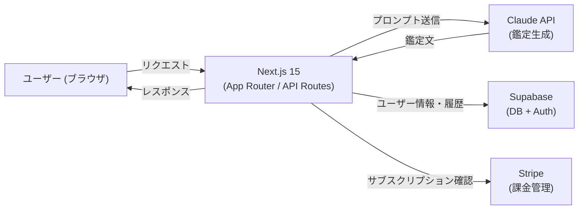

# Stellara — AI パーソナル占いサービス

Claude API を活用した、会話型パーソナル占い Web アプリ。星占い・タロット・チャット鑑定を対話形式で提供する。

> **Portfolio Project** — AI + フルスタック開発の技術力を示すポートフォリオプロジェクトです。
> デモは [stellara.chat](https://stellara.chat) で公開中

---

## 技術スタック

| カテゴリ | 技術 |
|---------|------|
| フレームワーク | Next.js 15 (App Router) |
| 言語 | TypeScript |
| AI | Claude API (Anthropic) |
| データベース | Supabase (PostgreSQL + Auth) |
| 決済 | Stripe |
| スタイリング | Tailwind CSS v4 |
| 国際化 | next-intl（日本語 / 英語） |
| テスト | Vitest + Playwright |

---

## 主な機能

- **デイリーホロスコープ** — 太陽星座ベースの今日の運勢（無料）
- **パーソナル星座鑑定** — 出生図（太陽・月・上昇星座）に基づく深い鑑定
- **タロットリーディング** — AI がカードを引き、対話で解釈を深める
- **フリーチャット鑑定** — 自由な質問に占い的視点で回答
- **Stripe 決済統合** — フリーミアム → Pro プランへのサブスクリプション管理

---

## アーキテクチャ概要

---

## テスト

| 種別 | 件数 | ツール |
|------|------|-------|
| ユニット / 統合テスト | 382 件 | Vitest |
| E2E テスト | 30 件 | Playwright |
| **合計** | **412 件** | |

---

## セキュリティ

- **プロンプトインジェクション多層防御** — システムプロンプト分離 + 入力サニタイズ + ロール検証
- **入力サニタイズ** — Zod スキーマによる全 API 入力のバリデーション
- **GDPR / CCPA 対応** — データ削除リクエスト対応、最小権限のデータ収集
- **Supabase RLS** — Row Level Security で全テーブルのアクセス制御

---

## デモ

**URL**: [stellara.chat](https://stellara.chat)

ログイン画面の「デモアカウントで試す」ボタンから全機能を体験できます。

---

## ライセンス

MIT（プロンプトファイル・ブランド資産を除く）。詳細は [LICENSE](./LICENSE) を参照。
